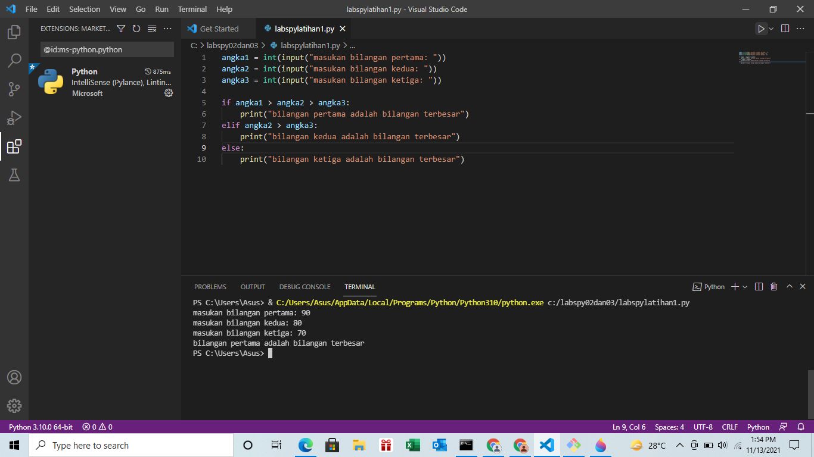

# labspy02dan03
## labspy02
### menentukan sebuah bilangan terbesar dari 3 buah bilangan
## flowchart
##### berikut bentuk flowchart untuk menentukan sebuah bilangan terbesar dari 3 buah bilangan

## menggunakan statemen if untuk mencari nilai terbesar dari 3 buah bilangan
##### angka1 adalah inisiasi bilangan pertama, elif untuk angka2 sebagai bilangan kedua dan angka3 bilangan ketiga
##### dengan cara statement if untuk angka1 sebagai bilangan pertama, elif untuk angka2 sebagai bilangan kedua dan else untuk angka3 bilangan ketiga, berikut gambar programnya

##### dan ini adalah hasil ketika program di jalankan, bilangan pertama yang terbesar

##### untuk bilangan kedua yang terbesar jika program di jalankan

##### sedangkan untuk bilangan ketiga yang terbesar jika program di jalankan

##### program menampilkan n bilangan acak yang lebih kecil dari 0.5

##### program menentukan bilangan terbesar sampai di input bilangan 0

##### program menghitung laba berdasarkan skenario yang di tentukan